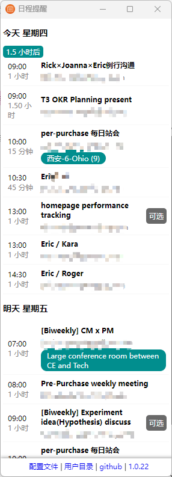

[中文](./README_ZH.md)
## Repository Name: **calendar-app** 

### Description:
A feature-rich, customizable desktop calendar application built with Electron, integrating Google Calendar for seamless event management and video conferencing via Google Meet.

---

### Sections to Include in Repository Details:

#### 1. **Overview**

Calendar App is a cross-platform, open-source calendar application designed to simplify event management by integrating with Google Calendar and offering features like real-time updates, conference linking, and advanced scheduling.

#### 2. **Key Features**

- Google Calendar sync
- Auto-updates for new versions
- Customizable launch modes for tailored experiences
- Conference integration (Google Meet)
- Manage recurring events
- Responsive and intuitive user interface

#### 3. **Installation**

```bash
# Clone the repository
git clone https://github.com/ericzzhou/calendar-app.git

# Navigate to the project directory
cd calendar-app

# Install dependencies
npm install

# Run the app
npm start
```

#### 4. **Usage**

After installation, you can sync your Google Calendar by logging in, view and manage your events, and join video meetings directly from the app. 



#### 5. **Contributing**

Contributions are welcome! Please check out our [CONTRIBUTING.md](link to contributing guidelines) for more information on how to get involved.

#### 6. **License**

This project is licensed under the MIT License - see the [LICENSE](link to license) file for details.